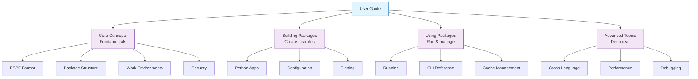

# User Guide

Welcome to the FlavorPack User Guide. This comprehensive guide covers everything you need to know about using FlavorPack to package and distribute Python applications.

## What's in This Guide

### :material-lightbulb: **Core Concepts**

Understand the fundamentals of FlavorPack and the PSPF format.

- **[PSPF Format](concepts/pspf-format.md)** - Progressive Secure Package Format specification
- **[Package Structure](concepts/package-structure.md)** - How packages are organized
- **[Work Environments](concepts/workenv.md)** - Caching and extraction model
- **[Security Model](concepts/security.md)** - Cryptographic signing and verification

### :material-hammer: **Building Packages**

Learn how to package your applications.

- **[Python Applications](packaging/python.md)** - Package Python apps and CLIs
- **[Manifest Files](packaging/manifest.md)** - Configure packaging with manifests
- **[Configuration](packaging/configuration.md)** - Advanced configuration options
- **[Signing Packages](packaging/signing.md)** - Cryptographically sign packages
- **[Platform Support](packaging/platforms.md)** - Cross-platform packaging

### :material-play: **Using Packages**

Execute and manage packaged applications.

- **[Running Packages](usage/running.md)** - Execute .psp files
- **[CLI Reference](usage/cli.md)** - Command-line interface
- **[Inspecting Packages](usage/inspection.md)** - View package contents
- **[Cache Management](usage/cache.md)** - Manage work environment cache
- **[Environment Variables](usage/environment.md)** - Configure runtime environment

### :material-cog: **Advanced Topics**

Deep dive into advanced features and customization.

- **[Cross-Language Support](advanced/cross-language.md)** - Go and Rust integration
- **[Custom Launchers](advanced/launchers.md)** - Build custom launchers
- **[Custom Builders](advanced/builders.md)** - Extend the build system
- **[Performance Tuning](advanced/performance.md)** - Optimize package size and speed
- **[Debugging](advanced/debugging.md)** - Troubleshoot issues

## Quick Navigation

Looking for something specific?

- **First time?** → Start with [Getting Started](../getting-started/index.md)
- **Need examples?** → Check out the [Cookbook](../cookbook/index.md)
- **Having issues?** → See [Troubleshooting](../troubleshooting/index.md)
- **Contributing?** → Read [Development Guide](../development/index.md)

## Documentation Structure

## Getting Help

If you can't find what you're looking for:

- 📖 Check the [Cookbook](../cookbook/index.md) for practical examples
- 📚 Review the [Glossary](../reference/glossary.md) for term definitions
- 🔍 Search the documentation (Ctrl+K or Cmd+K)
- 💬 Ask in [Community Support](../community/support.md)
- 🐛 Report issues on [GitHub](https://github.com/provide-io/flavorpack/issues)

---

**Ready to start?** Jump to [Core Concepts](concepts/index.md) or try the [Quick Start](../getting-started/quickstart.md).
