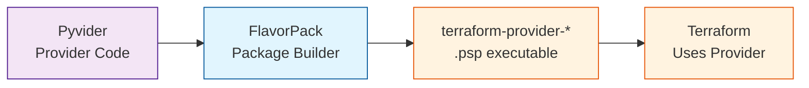

# Integration with Pyvider

Package Terraform providers built with Pyvider into self-contained executables.

!!! info "Optional Integration"
    **FlavorPack works standalone** without Pyvider. This integration is optional.

    Use FlavorPack with Pyvider when you want to package Terraform providers written in Python into self-contained executables.

## Overview

[Pyvider](https://foundry.provide.io/pyvider/) enables building Terraform providers in Python. FlavorPack packages them into standalone binaries that Terraform can execute without requiring Python installation.



## Quick Start

### 1. **Create a Pyvider Provider**

```python
# src/terraform_provider_example/__init__.py
from pyvider import provider, resource, data_source
from pyvider.schema import Attribute

@provider
class ExampleProvider:
    """Example Terraform provider"""

    api_key: str = Attribute(
        description="API key for authentication",
        required=True,
        sensitive=True
    )

@resource
class Server:
    """Manage server resources"""

    name: str = Attribute(
        description="Server name",
        required=True
    )

    size: str = Attribute(
        description="Server size",
        default="small"
    )

    def create(self, config):
        # Create server logic
        return {"id": "server-123", **config}

    def read(self, id):
        # Read server logic
        return {"id": id, "name": "my-server", "size": "small"}

    def update(self, id, config):
        # Update server logic
        return {"id": id, **config}

    def delete(self, id):
        # Delete server logic
        pass
```

### 2. **Configure Provider Manifest**

```toml
# pyproject.toml
[project]
name = "terraform-provider-example"
version = "1.0.0"
dependencies = [
    "pyvider>=1.0.0",
    "requests>=2.28.0",
]

[tool.flavor]
type = "terraform-provider"
provider_name = "example"

[tool.flavor.execution]
command = "{workenv}/bin/python"
args = ["-m", "pyvider.plugin"]

[tool.flavor.execution.runtime.env]
pass = ["TF_*", "EXAMPLE_*"]
```

### 3. **Package the Provider**

```bash
# Package for Terraform
flavor pack \
  --manifest pyproject.toml \
  --output terraform-provider-example.psp

# Rename to Terraform convention
mv terraform-provider-example.psp terraform-provider-example_v1.0.0
```

## Terraform Integration

### Install Provider

```bash
# Copy to Terraform plugins directory
mkdir -p ~/.terraform.d/plugins/localhost/providers/example/1.0.0/darwin_arm64/
cp terraform-provider-example_v1.0.0 \
   ~/.terraform.d/plugins/localhost/providers/example/1.0.0/darwin_arm64/terraform-provider-example_v1.0.0

# Make executable
chmod +x ~/.terraform.d/plugins/localhost/providers/example/1.0.0/darwin_arm64/terraform-provider-example_v1.0.0
```

### Use in Terraform

```hcl
# main.tf
terraform {
  required_providers {
    example = {
      source  = "localhost/providers/example"
      version = "1.0.0"
    }
  }
}

provider "example" {
  api_key = var.example_api_key
}

resource "example_server" "web" {
  name = "web-server"
  size = "large"
}
```

## Multi-Platform Providers

### Package for All Platforms

```bash
# Build for each platform
for platform in linux_amd64 darwin_arm64 darwin_amd64 windows_amd64; do
  flavor pack \
    --platform $platform \
    --output terraform-provider-example_v1.0.0_$platform
done
```

### Provider Registry Structure

```
~/.terraform.d/plugins/
└── localhost/
    └── providers/
        └── example/
            └── 1.0.0/
                ├── darwin_arm64/
                │   └── terraform-provider-example_v1.0.0
                ├── darwin_amd64/
                │   └── terraform-provider-example_v1.0.0
                ├── linux_amd64/
                │   └── terraform-provider-example_v1.0.0
                └── windows_amd64/
                    └── terraform-provider-example_v1.0.0.exe
```

## Advanced Features

### Provider with State Management

```python
@resource
class Database:
    """Database resource with state"""

    name: str = Attribute(required=True)

    def create(self, config):
        db_id = self.api.create_database(config.name)
        # Return full state
        return {
            "id": db_id,
            "name": config.name,
            "endpoint": f"{config.name}.db.example.com",
            "created_at": datetime.now().isoformat()
        }
```

### Custom Packaging Configuration

```toml
[tool.flavor.terraform]
provider_name = "example"
namespace = "mycompany"
version = "1.0.0"

[[tool.flavor.slots]]
id = 2
path = "./schemas"
extract_to = "schemas"
lifecycle = "cached"
operations = "tar+gzip"
```

## Testing Providers

### Test Before Packaging

```bash
# Test provider locally
python -m pyvider.dev serve

# In another terminal
terraform init
terraform plan
terraform apply
```

### Integration Tests

```python
# tests/test_provider.py
from pyvider.testing import ProviderTest

def test_server_creation():
    test = ProviderTest("example")

    server = test.create_resource("example_server", {
        "name": "test-server",
        "size": "small"
    })

    assert server.id.startswith("server-")
    assert server.name == "test-server"
```

## Distribution

### Private Registry

```bash
# Upload to your registry
aws s3 sync terraform-providers/ s3://my-terraform-registry/providers/
```

### Terraform Cloud/Enterprise

```bash
# Package for TFC/TFE
flavor pack \
  --manifest pyproject.toml \
  --sign \
  --output terraform-provider-example_v1.0.0
```

## Benefits

1. **No Python Required**: Users don't need Python installed
2. **Single Binary**: Easy distribution and deployment
3. **Version Lock**: Exact provider version in every environment
4. **Security**: Signed, verified providers
5. **Fast**: Native execution with minimal overhead

## Troubleshooting

### Provider Not Found

```bash
# Check installation
ls ~/.terraform.d/plugins/localhost/providers/example/1.0.0/

# Verify permissions
chmod +x ~/.terraform.d/plugins/localhost/providers/example/1.0.0/*/terraform-provider-example_v1.0.0
```

### Protocol Version Mismatch

```toml
# Ensure correct pyvider version
[project]
dependencies = [
    "pyvider>=1.0.0,<2.0.0",  # Lock major version
]
```

## See Also

- **[Pyvider Documentation](https://foundry.provide.io/pyvider/)**
- **[wrknv Integration](wrknv.md)**
- **[CI/CD Integration](../../cookbook/recipes/ci-cd.md)**
- **[Multi-Platform Builds](../../cookbook/recipes/multi-platform.md)**
