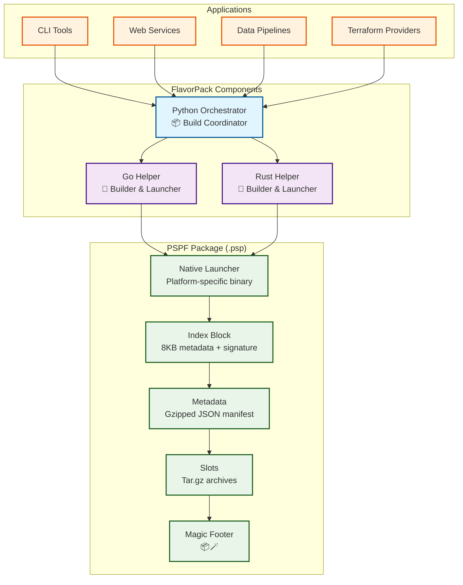

# Welcome to FlavorPack

!!! warning "Alpha Software - Development Version"
    FlavorPack is currently in early alpha. APIs, file formats, and commands may change without notice. Not recommended for production use. Check current version with `flavor --version`. **Source installation only** at this time.

**FlavorPack** is a cross-language packaging system that creates self-contained, portable executables using the **Progressive Secure Package Format (PSPF/2025)**. Ship Python applications as single binaries that "just work" - no installation, no dependencies, no configuration required.

<div class="grid cards" markdown>

-   :fontawesome-solid-rocket:{ .lg .middle } **Get Started Quickly**

    ---

    Package your first application in under 5 minutes with our comprehensive quickstart guide.

    [:octicons-arrow-right-24: Quick Start](getting-started/quickstart.md)

-   :fontawesome-solid-cube:{ .lg .middle } **Single-File Distribution**

    ---

    Package entire applications into one executable that runs anywhere without dependencies.

    [:octicons-arrow-right-24: Package Structure](guide/concepts/package-structure.md)

-   :fontawesome-solid-shield:{ .lg .middle } **Secure by Default**

    ---

    Ed25519 signature verification ensures package integrity and authenticity.

    [:octicons-arrow-right-24: Security Model](guide/concepts/security.md)

-   :fontawesome-solid-bolt:{ .lg .middle } **Progressive Extraction**

    ---

    Smart caching extracts only what's needed, when it's needed, for optimal performance.

    [:octicons-arrow-right-24: Work Environments](guide/concepts/workenv.md)

-   :fontawesome-solid-language:{ .lg .middle } **Cross-Language Support**

    ---

    Python orchestrator with native Go and Rust launchers for maximum efficiency.

    [:octicons-arrow-right-24: Architecture](development/architecture.md)

-   :fontawesome-solid-book:{ .lg .middle } **Comprehensive Docs**

    ---

    Detailed guides, API reference, cookbook examples, and troubleshooting help.

    [:octicons-arrow-right-24: User Guide](guide/index.md)

</div>

## What is FlavorPack?

FlavorPack transforms Python applications into self-contained executables using the Progressive Secure Package Format (PSPF/2025). Each package contains everything needed to run - the application code, Python runtime, dependencies, and a native launcher - all in a single `.psp` file.

### Key Features

- **📦 Single-File Distribution**: Package entire applications into one executable file
- **🔒 Cryptographic Security**: Ed25519 signatures ensure package integrity
- **⚡ Smart Caching**: Persistent work environment with intelligent validation
- **🌍 Cross-Platform**: Works on Linux, macOS, and Windows
- **🎯 Zero Dependencies**: End users need nothing pre-installed
- **🔧 Native Performance**: Go and Rust launchers for fast execution

## Quick Example

```bash
# Package a Python application
flavor pack --manifest pyproject.toml --output myapp.psp

# Run the packaged application (no Python installation required!)
./myapp.psp

# Verify package integrity
flavor verify myapp.psp
```

## Architecture Overview

FlavorPack is a cross-language packaging system designed to work seamlessly with other provide.io tools:



## PSPF Format

The Progressive Secure Package Format is a polyglot file that works as both an OS executable and a structured package. Each `.psp` file is structured with a native launcher at the start, followed by package metadata and compressed data slots, ending with a cryptographically signed index block.

**Key Components**:
- **Native Launcher**: Platform-specific executable (Go or Rust)
- **Metadata Block**: Compressed JSON manifest with package information
- **Slot Table**: Array of 64-byte descriptors (one per slot)
- **Slot Data**: Compressed application code, runtime, and dependencies
- **Index Block**: 8KB structure containing offsets, checksums, and Ed25519 signatures
- **Magic Markers**: 📦 and 🪄 emoji bytes for format identification

For the complete binary layout diagram and technical specification, see:
→ [PSPF Format Specification (FEP-0001)](reference/spec/fep-0001-core-format-and-operation-chains.md#32-package-structure-overview)

## Use Cases

!!! example "Perfect for..."
    - **CLI Tools**: Distribute command-line applications without requiring Python installation
    - **Data Science**: Package ML models with their entire environment
    - **DevOps**: Deploy self-contained tools that work everywhere
    - **Enterprise**: Secure, signed packages with verification built-in
    - **Terraform**: Package custom providers as single executables

## Platform Support

--8<-- "includes/platform-support.md"

## Community

### :material-github: GitHub

All development happens on GitHub with issues, discussions, and pull requests welcome.

[View on GitHub :octicons-arrow-right-24:](https://github.com/provide-io/flavorpack){ .md-button .md-button--primary }

### :material-chat: Support

Join the community for questions, ideas, and collaboration.

[Get Support :octicons-arrow-right-24:](community/support.md){ .md-button }

### :material-book-open: Documentation

Comprehensive guides, tutorials, and API documentation.

[Explore Docs :octicons-arrow-right-24:](getting-started/index.md){ .md-button }

---

**Ready to package your Python applications?** Check out our [Quick Start guide](getting-started/quickstart.md) or dive into the [core concepts](guide/concepts/index.md).
